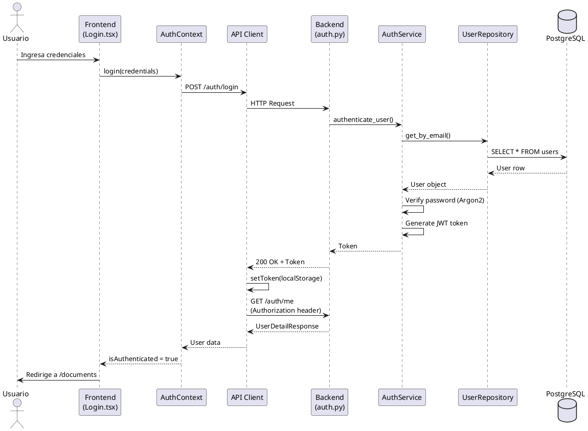

# Integración End-to-End — StudyForge

**Última actualización:** 2025-11-21

Este documento describe los flujos completos de integración entre frontend, backend y base de datos. Útil para debugging, onboarding y generación de diagramas de secuencia.

---

## Nota sobre Arquitectura Frontend

**StudyForge usa una arquitectura SPA pura** (Single Page Application) con React 19 y React Router v7:

- **Navegación client-side**: Todas las rutas usan `<Link>` de React Router (sin recargas de página)
- **Landing page dinámica**: El componente `LandingPage.tsx` se muestra solo para usuarios no autenticados
- **Routing condicional**: `Home.tsx` (ruta `/`) decide entre mostrar landing o redirigir a `/documents`
- **Rutas protegidas**: `ProtectedRoute` HOC verifica autenticación antes de renderizar
- **Sin archivos HTML estáticos**: Toda la UI se genera con componentes React

Esta arquitectura garantiza una experiencia de usuario fluida sin interrupciones durante la navegación.

---

## Flujo 1: Autenticación de Usuario

### Descripción

Usuario inicia sesión, obtiene token JWT, y es redirigido al dashboard.

### Secuencia Detallada

```
1. Frontend (Login.tsx)
   ↓ Usuario ingresa email y contraseña
   ↓ onClick submit: useAuth().login(credentials)

2. AuthContext (context/AuthContext.tsx)
   ↓ Llama a apiLogin(credentials)
   ↓ Maneja estado de loading

3. API Client (services/api.ts)
   ↓ POST http://localhost:8000/auth/login
   ↓ Body: { "email": "user@example.com", "password": "password123" }
   ↓ Interceptor añade headers (Content-Type: application/json)

4. Backend Router (routers/auth.py)
   ↓ Recibe request
   ↓ Valida con Pydantic schema (UserLogin)
   ↓ Llama a await AuthService.authenticate_user(email, password)

5. Auth Service (services/auth_service.py)
   ↓ Llama a UserRepository.get_by_email(db, email)

6. User Repository (repositories/user_repository.py)
   ↓ Ejecuta: db.query(User).filter(User.email == email).first()

7. Base de Datos (PostgreSQL)
   ↓ Ejecuta query:
   ↓ SELECT * FROM studyforge.users
   ↓ WHERE email = 'user@example.com' AND is_active = true
   ← Retorna User row con hashed_password

8. Auth Service
   ↓ Verifica contraseña con Argon2:
   ↓ argon2.verify(hashed_password, plain_password)
   ↓ Si válido, genera JWT token:
   ↓ token = create_access_token(data={"sub": user.id})
   ← Retorna Token { "access_token": "eyJ...", "token_type": "bearer" }

9. API Client (interceptor de response)
   ↓ Recibe status 200 OK
   ↓ Llama a setToken(token.access_token, remember=true)
   ↓ localStorage.setItem("sf_token", "eyJ...")

10. AuthContext
    ↓ Token guardado, ahora llama a getCurrentUser()
    ↓ GET http://localhost:8000/auth/me
    ↓ Interceptor añade: Authorization: Bearer eyJ...

11. Backend Router (routers/auth.py)
    ↓ Dependency get_current_user valida token JWT
    ↓ Decodifica token, extrae user_id
    ↓ UserRepository.get_by_id(db, user_id)
    ← Retorna UserDetailResponse

12. AuthContext
    ↓ setUser(userData)
    ↓ isAuthenticated = true
    ← Usuario autenticado

13. Frontend
    ↓ Redirige a /documents (primera página protegida)
    ↓ Navbar muestra nombre de usuario
```

### Manejo de Errores

**Error: Contraseña incorrecta**
```
5. Auth Service
   ↓ Argon2 verify fails
   ↓ Lanza HTTPException(status_code=401, detail="Credenciales inválidas")
   ← Backend retorna 401 Unauthorized

9. API Client
   ↓ axios.catch((error) => ...)
   ↓ Extrae error.response?.data.detail
   ← "Credenciales inválidas"

10. Frontend (Login.tsx)
    ↓ Muestra toast/alert con mensaje
    ↓ No redirige, usuario puede reintentar
```

**Error: Token expirado (en requests posteriores)**
```
Backend retorna 401 Unauthorized
   ↓
API Client interceptor detecta status === 401
   ↓
clearToken() // Elimina de localStorage
   ↓
window.location.href = "/login"
   ↓
Usuario debe re-autenticarse
```

---

## Flujo 2: Generación de Resumen desde Documentos

### Descripción

Usuario selecciona documentos existentes, elige nivel de expertise, y genera un resumen con IA.

### Secuencia Detallada

```
1. Frontend (SummariesPage.tsx)
   ↓ Usuario selecciona checkboxes de 2 documentos
   ↓ Selecciona expertise_level = "medio"
   ↓ Ingresa título opcional: "Resumen de Física Cuántica"
   ↓ onClick: handleCreateSummary()

2. Frontend (services/api.ts)
   ↓ Llama a createSummaryFromDocuments({
       document_ids: ["uuid1", "uuid2"],
       expertise_level: "medio",
       title: "Resumen de Física Cuántica"
     })
   ↓ POST http://localhost:8000/summaries/from-documents
   ↓ Interceptor añade: Authorization: Bearer <token>

3. Backend Router (routers/summaries.py)
   ↓ Dependency get_current_user valida JWT token
   ↓ Valida schema: SummaryCreateFromDocuments
   ↓ Verifica que len(document_ids) <= user.max_documents_per_summary
   ↓ Llama a SummaryService.create_from_documents(...)

4. Summary Service (services/summary_service.py)
   ↓ Llama a DocumentRepository.get_by_ids(db, document_ids)
   ↓ Verifica ownership: verify_document_ownership(doc, current_user)

5. Document Repository
   ↓ Ejecuta: db.query(Document).filter(
       Document.id.in_(document_ids),
       Document.user_id == current_user.id
     ).all()

6. Base de Datos
   ↓ SELECT * FROM studyforge.documents
   ↓ WHERE id IN ('uuid1', 'uuid2')
   ↓ AND user_id = '<current_user_id>'
   ← Retorna 2 Document rows con extracted_text

7. Summary Service
   ↓ Extrae textos: texts = [doc.extracted_text for doc in documents]
   ↓ Combina textos en uno solo
   ↓ Llama a OpenAIService.generate_summary(
       combined_text,
       expertise_level="medio"
     )

8. OpenAI Service (services/openai_service.py)
   ↓ Construye prompt según expertise_level:
   ↓ "Genera un resumen nivel medio (balance detalle/claridad)..."
   ↓ Llama a OpenAI API:
   ↓ client.chat.completions.create(
       model="gpt-4o-mini",
       messages=[{"role": "system", "content": prompt}, ...],
       response_format={"type": "json_object"}
     )
   ← Recibe JSON estructurado:
     {
       "summary": "Texto del resumen...",
       "key_points": ["Punto 1", "Punto 2", ...],
       "topics": ["Mecánica Cuántica", "Principio de Incertidumbre"],
       "key_concepts": ["Entrelazamiento", "Superposición"]
     }

9. Summary Service
   ↓ Crea Summary object:
   ↓ summary = Summary(
       id=uuid.uuid4(),
       user_id=current_user.id,
       title="Resumen de Física Cuántica",
       content=openai_response["summary"],
       expertise_level="medio",
       topics=openai_response["topics"],
       key_concepts=openai_response["key_concepts"],
       original_file_name="documento1.pdf, documento2.pdf",
       original_file_type="pdf"
     )
   ↓ Llama a SummaryRepository.create(db, summary)

10. Summary Repository
    ↓ db.add(summary)
    ↓ db.commit()
    ↓ db.refresh(summary)

11. Base de Datos
    ↓ INSERT INTO studyforge.summaries
    ↓ (id, user_id, title, content, expertise_level, topics, key_concepts, ...)
    ↓ VALUES (...)
    ← Retorna summary completo con timestamps

12. Backend Router
    ↓ Convierte a SummaryDetailResponse (Pydantic)
    ← Retorna 201 Created con summary JSON

13. API Client
    ↓ Recibe status 201
    ↓ Parsea response.data (SummaryDetailResponse)

14. Frontend (SummariesPage.tsx)
    ↓ Actualiza lista de resúmenes (refetch o append)
    ↓ Muestra toast: "Resumen creado exitosamente"
    ← Redirige a /summaries/{summary_id}

15. Frontend (SummaryDetail.tsx)
    ↓ Muestra resumen completo con formato
    ↓ Botón "Generar Quiz" disponible
```

### Manejo de Errores

**Error: Documento no pertenece al usuario**
```
4. Summary Service
   ↓ verify_document_ownership lanza HTTPException(403)
   ← Backend retorna 403 Forbidden

13. Frontend
    ↓ axios.catch muestra error
    ↓ "No tienes acceso a uno o más documentos"
```

**Error: OpenAI API falla**
```
8. OpenAI Service
   ↓ OpenAI retorna 500 Internal Server Error
   ↓ OpenAIService lanza HTTPException(503, "Servicio de IA no disponible")

13. Frontend
    ↓ Muestra error: "Error al generar resumen, intenta más tarde"
    ↓ Usuario puede reintentar
```

---

## Flujo 3: Quiz con Feedback Inmediato

### Descripción

Usuario inicia un quiz, responde preguntas con feedback instantáneo, y obtiene resultados finales.

### Secuencia Detallada

```
1. Frontend (QuizzesPage.tsx)
   ↓ Usuario ve quiz "Física Cuántica - 10 preguntas"
   ↓ onClick: "Iniciar Quiz"
   ↓ navigate(`/quizzes/${quizId}/attempt`)

2. Frontend (QuizAttemptPage.tsx - useEffect)
   ↓ Llama a createQuizAttempt({ quiz_id: quizId })
   ↓ POST http://localhost:8000/quiz-attempts
   ↓ Body: { "quiz_id": "uuid-quiz-123" }

3. Backend Router (routers/quiz_attempts.py)
   ↓ Dependency get_current_user valida JWT
   ↓ Valida schema: QuizAttemptCreate
   ↓ Llama a QuizAttemptRepository.create_attempt(db, quiz_id, user)

4. Quiz Attempt Repository (repositories/quiz_attempt_repository.py)
   ↓ Lee quiz.questions (JSONB):
   ↓ quiz = db.query(Quiz).filter(Quiz.id == quiz_id).first()
   ↓ questions = quiz.questions  # Array de objetos JSON

5. Quiz Attempt Repository - Randomización
   ↓ Para cada pregunta:
   ↓   - Extrae opciones: [correct, semi_correct, incorrect1, incorrect2]
   ↓   - Randomiza orden: random.shuffle(options)
   ↓   - Mapea posición correcta: correct_letter = find_position(correct_option)
   ↓ Genera array: correct_answers = ["B", "A", "D", "C", ...]

6. Quiz Attempt Repository
   ↓ Crea QuizAttempt:
   ↓ attempt = QuizAttempt(
       id=uuid.uuid4(),
       quiz_id=quiz_id,
       user_id=current_user.id,
       started_at=datetime.now(),
       correct_answers=["B", "A", "D", "C", ...],  # Posiciones aleatorias
       user_answers=[]  # Vacío al inicio
     )
   ↓ db.add(attempt)
   ↓ db.commit()

7. Base de Datos
   ↓ INSERT INTO studyforge.quiz_attempts
   ↓ (id, quiz_id, user_id, started_at, correct_answers, user_answers)
   ↓ VALUES (...)
   ← Retorna attempt con id

8. Backend Router
   ↓ Retorna QuizAttemptWithQuestionsResponse:
   ↓ {
       "id": "attempt-uuid",
       "quiz_id": "quiz-uuid",
       "started_at": "2025-11-20T10:00:00",
       "questions": [
         {
           "index": 0,
           "question": "¿Qué es...?",
           "options": ["Opción B", "Opción A", "Opción D", "Opción C"],  // Randomizado
           "explanation": "Explicación..."
         }
       ]
     }

9. Frontend (QuizAttemptPage.tsx)
   ↓ Guarda attempt y questions en state
   ↓ Muestra primera pregunta (index 0)
   ↓ Usuario lee y selecciona opción "A"

10. Frontend - Usuario responde
    ↓ onClick opción "A": handleAnswer(0, "A")
    ↓ POST http://localhost:8000/quiz-attempts/{attemptId}/answer
    ↓ Body: { "question_index": 0, "answer": "A" }

11. Backend Router (routers/quiz_attempts.py)
    ↓ Lee attempt.correct_answers[0]  // Ej: "B"
    ↓ Compara "A" === "B"  // false
    ↓ is_correct = false
    ↓ Actualiza attempt.user_answers[0] = "A"
    ↓ db.commit()

12. Base de Datos
    ↓ UPDATE studyforge.quiz_attempts
    ↓ SET user_answers = jsonb_set(user_answers, '{0}', '"A"')
    ↓ WHERE id = '<attempt-uuid>'

13. Backend Router
    ← Retorna AnswerFeedback:
      {
        "is_correct": false,
        "correct_answer": "B",
        "explanation": "La respuesta correcta es B porque..."
      }

14. Frontend (QuizAttemptPage.tsx)
    ↓ Muestra feedback inmediato:
    ↓ ❌ Icono rojo + "Incorrecto"
    ↓ Muestra explicación detallada
    ↓ Botón "Siguiente pregunta" habilitado

15. Usuario avanza a pregunta 1, 2, 3... hasta 9
    ↓ Repite flujo 10-14 para cada pregunta
    ↓ user_answers = ["A", "C", "B", "D", ...]

16. Última pregunta respondida
    ↓ onClick "Finalizar Quiz": handleComplete()
    ↓ POST http://localhost:8000/quiz-attempts/{attemptId}/complete

17. Backend Router
    ↓ Lee attempt.correct_answers y attempt.user_answers
    ↓ Compara arrays:
    ↓ correct_count = sum(1 for i in range(len(user_answers))
                          if user_answers[i] == correct_answers[i])
    ↓ score = (correct_count / total_questions) * 100
    ↓ Actualiza:
    ↓ attempt.completed_at = datetime.now()
    ↓ attempt.score = score
    ↓ db.commit()

18. Base de Datos
    ↓ UPDATE studyforge.quiz_attempts
    ↓ SET completed_at = NOW(), score = 70.0
    ↓ WHERE id = '<attempt-uuid>'

19. Backend - Dificultad Adaptativa
    ↓ QuizService.calculate_adaptive_difficulty(user, topic)
    ↓ Lee últimos 5 intentos del usuario en ese tema
    ↓ Calcula promedio de scores
    ↓ Ajusta difficulty_level para próximo quiz

20. Frontend
    ↓ Redirige a /quiz-attempts/{attemptId}/results
    ↓ QuizResultsPage.tsx muestra:
    ↓ - Score: 70/100
    ↓ - 7 correctas, 3 incorrectas
    ↓ - Desglose por pregunta
    ↓ - Botón "Intentar nuevo quiz"
```

### Manejo de Errores

**Error: Usuario intenta responder pregunta ya respondida**
```
11. Backend Router
    ↓ Verifica si user_answers[question_index] ya existe
    ↓ Lanza HTTPException(400, "Pregunta ya respondida")

14. Frontend
    ↓ Muestra error (no debería ocurrir si UI está bien)
```

**Error: Usuario cierra pestaña sin completar**
```
Base de Datos
   ↓ Attempt queda con completed_at = NULL
   ↓ Puede recuperarse después mostrando "Quiz incompleto"

Frontend (futuro)
   ↓ Mostrar botón "Retomar quiz" si attempt.completed_at es NULL
```

---

## Flujo 4: Upload de Documento

### Descripción Breve

Usuario sube un archivo PDF, el sistema lo valida, extrae texto y almacena.

### Secuencia Resumida

```
1. Frontend (DocumentsPage.tsx)
   ↓ Usuario drag & drop archivo "fisica.pdf" (2 MB)
   ↓ POST /documents con FormData

2. Backend (routers/documents.py)
   ↓ Valida magic numbers (file_utils.validate_file_type)
   ↓ Verifica cuota: user.storage_available_bytes >= file.size
   ↓ FileProcessor.extract_text(file.file, file.content_type)

3. FileProcessor (services/file_processor.py)
   ↓ Extrae texto con pdfplumber
   ↓ extracted_text = "Contenido del PDF..."

4. Document Repository
   ↓ Crea Document con file_content (bytea) y extracted_text
   ↓ Actualiza user.storage_used_bytes += file_size

5. Base de Datos
   ↓ INSERT INTO studyforge.documents
   ↓ UPDATE studyforge.users SET storage_used_bytes = ...

6. Frontend
   ← Muestra documento en lista
   ← Actualiza QuotaWidget con nuevo porcentaje usado
```

---

## Patrones Comunes de Integración

### 1. Autenticación JWT en Todos los Requests

**Frontend (api.ts interceptor)**:
```typescript
apiClient.interceptors.request.use((config) => {
  const token = getToken();
  if (token) {
    config.headers.Authorization = `Bearer ${token}`;
  }
  return config;
});
```

**Backend (dependencies.py)**:
```python
async def get_current_user(
    token: str = Depends(oauth2_scheme),
    db: Session = Depends(get_db)
):
    payload = jwt.decode(token, SECRET_KEY, algorithms=[ALGORITHM])
    user_id = payload.get("sub")
    user = UserRepository.get_by_id(db, user_id)
    if not user or not user.is_active:
        raise HTTPException(401, "Usuario inválido")
    return user
```

### 2. Validación de Ownership

**Patrón repetido en todos los endpoints protegidos**:
```python
# Obtener recurso
document = DocumentRepository.get_by_id(db, document_id)
if not document:
    raise HTTPException(404, "No encontrado")

# Validar ownership
verify_document_ownership(document, current_user)

# Proceder con operación
```

### 3. Manejo de Errores Consistente

**Backend lanza HTTPException**:
```python
raise HTTPException(
    status_code=403,
    detail="No tienes acceso a este recurso"
)
```

**Frontend captura y muestra**:
```typescript
try {
  await api.deleteDocument(id);
} catch (error) {
  const message = error.response?.data.detail || "Error desconocido";
  toast.error(message);
}
```

---

## Diagramas de Secuencia (PlantUML)

### Ejemplo: Autenticación



---

## Referencias

- Modelo de datos: [DATABASE.md](DATABASE.md)
- Arquitectura general: [ARCHITECTURE.md](ARCHITECTURE.md)
- Seguridad: [SECURITY.md](SECURITY.md)
- Código fuente:
  - Backend routers: `backend/app/routers/`
  - Backend services: `backend/app/services/`
  - Frontend API client: `frontend/src/services/api.ts`
